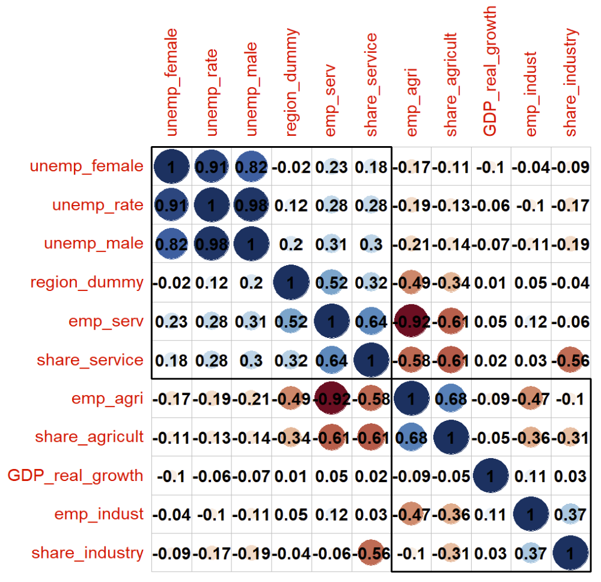

# Correlation: A Naive Approach

Before considering any models, it is best to start of by just naively looking at correlations. As you may have noticed, we have a bunch of categorical variables, which poses a problem to "calculating" correlations. &#x20;

There are two options when it comes to categorical variables: creating dummies or considering correlations by groups. In the following we will stick to the former. This works well if we only have a binary variable, such as region, which differentiates between "Advanced Economies" or "Emerging Markets and Developing Economies". We want to see whether there is any correlation between GDP real growth and the regions. \
For this, create a dummy variable where the region dummy is 1 for "Advanced Economies", and 0 for "Emerging Markets and Developing Economies".

Then, calculate a correlation plot. Since you have plenty of variables you do not have to stick to variables we have in our example, feel free to use more/others! Explain to us shortly what correlations you can observe with GDP real growth.&#x20;

**TODO: please someone update this picture!**

<figure><figcaption></figcaption></figure>

>  \
> For this we recommend you to use the `corrplot` package. You need to keep in mind that you first need to `select` the relevant variables for your correlation matrix. Then turn your data frame into a correlation matrix, by using the command `cor()`. Keep in mind that you need to take care of how missing values are treated.&#x20;

> \
> @Python please add!
