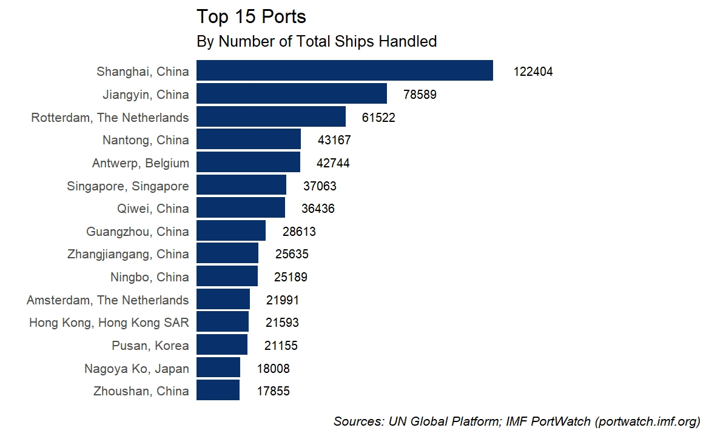

# Discovering Ports

Now that the shares in the port data are in a sensible format with which you can work, we want to know more about the significant ports. There are multiple variables you could use to complete this task, on one hand you could determine the local importance of a port by looking at the export & import shares for a country. On the other hand, you could examine global significance by looking at how many vessels are handled in a given port. We would like to examine the latter for now: Plot the top 15 significant ports by using the total amount of vessels handled by the port.

Just to give you an idea how to solve this problem: You would need to sort and rearrange your data before plotting it. Think about which variables you need, and how you would need to sort your data to answer the question at hand.

Furthermore, not only do you care to preserve the total number of ships for later interpretation, perhaps keeping other variables which would give you more information is also important. Do you need the port ID, or is the port name more important? What other information on the ports do you find useful?

<figure><figcaption></figcaption></figure>

To remind you of the task at hand and what output we expect:

* [ ] Plot the top 15 significant ports, by using the total amount of vessels handled by the port.
* [ ] Give us an extract of your table and explain what you observe, and explain possible issues with the dataset.
* [ ] Let us know what your thought process is, and extensively comment your code!

>  \
> For this task, you again should use the `dyplr` package, as well as `ggplot2`. Selecting, filtering and arranging should be know to you after this task.\
> For the plot, consider `geom_col()` and flip the coordinates accordingly, this will be much easier.&#x20;
>
> For the table output in Rmd (R markdown), look up what `knitr::kable()` can do for you!

>  \
> @python please add
