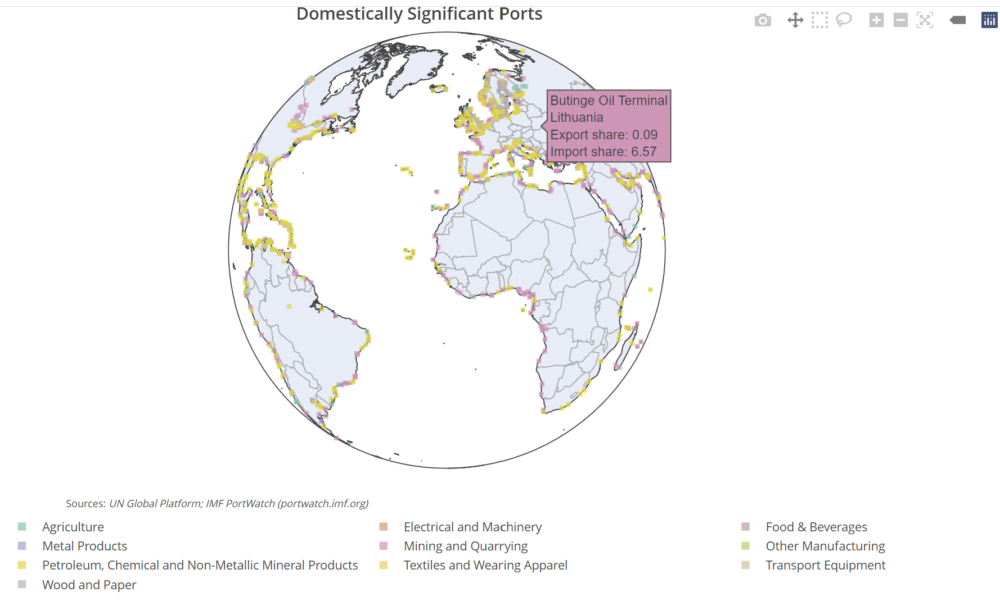

# Mapping It Out

Remeber that we wanted to keep longitude and latitude in our geographical\_location data set, and renamed the variables to be short and less messy? This will be useful now since we are going to plot all ports onto a map now!&#x20;

We will build the map using the `plotly` package. While you could have also plotted all previous graphs with plotly too, it is more cumbersome to do so, but it does an amazing job with maps.&#x20;

The results should be a map (it does not have to be a globe!), where all ports are mapped down. When hovering your mouse over a port, you should get a pop-up with the information as in the below example.

<figure><figcaption></figcaption></figure>

>  \
> `Plotly` follows the same logic as dplyr, thus you will be using many pipes `%>%`.\
> For this task, you can refer to the following links to build your map: [link 1](https://plotly.com/r/scatter-plots-on-maps/) and [link 2](https://plotly.com/r/map-configuration/).
>
> Since we have not introduced building R Shiny websites within the scope of this semester program, there will be issues when knitting the Rmd and you will not see the results in your html output. Thus, save your graph into an object, and save as html, which you need to hand in separately. The below code should help you in this:&#x20;
>
> ```r
> fig <- plotly() #this is your plot
> saveWidget(fig, "fig.html", selfcontained = F, libdir = "lib")
> #you will have to hand in your fig.html file alongside your other files
> ```


> @python please add
