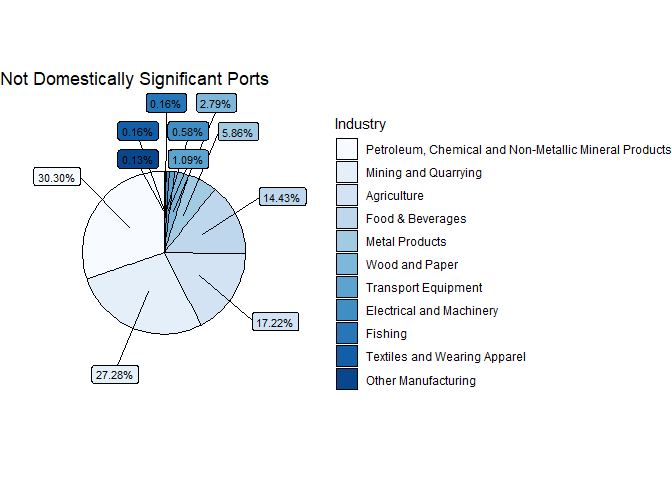

# Top Industries

Now that you have one large data set with all possible information, as well as a distinction between domestically significant ports and not domestically significant, we would like to find out more what the difference between these ports are. As we have hypothesized earlier, domestically significant ports could be vital to the infrastructure and supply of goods to countries. For this, we will look at the top three industries of each port.&#x20;

* [ ] Start by counting how many unique values each top industry variable has and report your finding.&#x20;
* [ ] How many missing values are in these three industry values. Determine this for the entire data set, as well as for the two subsets of domestically significant ports and not domestically significant ports.&#x20;

Then, after some calculations, plot a pie chart for domestically significant ports which depicts the share each industries named as top 3.&#x20;

As an example, have a look at the below pie chart for not domestically significant ports:

<figure><figcaption>
<em>Sources: UN Global Platform; IMF PortWatch (portwatch.imf.org)</em>
</figcaption></figure>

After you have plotted your pie chart, explain in a few sentences what you find. Are the industry shares vastly different?

> \
> As always, we recommend you to use `dplyr`, especially `mutate()` and `group_by()` will be your friends here when doing your calculations, as well as `tally()`.&#x20;
>
> For plotting, use the ggplot2 packages. As you may see on the cheat sheet, there is no pie chart, thus the structure:
>
> `geom_bar() +`\
> `coord_polar("y", start = 0)`&#x20;
>
> in your pie chart. `colorRampPalette` may also help you with achieving pie charts in nice colours.

> @python team please add
